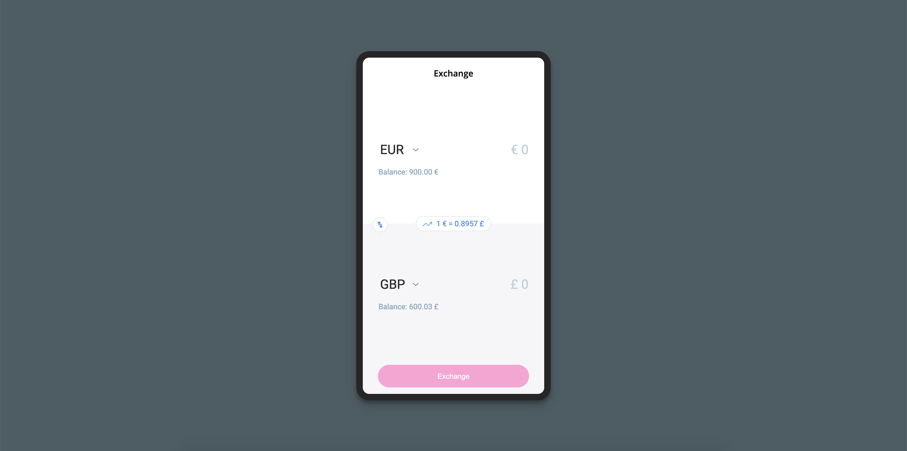
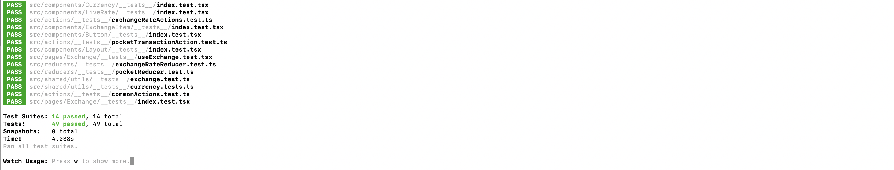

## Features of the Exchange app
1. User has three currency pockets EUR, GBP, USD and their respective balances, we are using predefined initial balances for this app.
    * In the real scenario, we can fetch those from the backend.
2. User can exchange within source and destination currency types using any of the currency pocket balance to transact.
    * User can type the amount in source pocket and see the amount in destination pocket or visa versa according to the live rate.
    * If the amount in source pocket is greater than the pocket balance for that currency, an error is shown i.e exceeds balance.
    * User can switch/swap the source and destination currency types using a switch/swap button.
    * We took an assumption that our app doesn't allow the user to transfer more than 999,999,999.99 due to government regulations.
3. The exchange rate is fetched using free API https://api.exchangeratesapi.io and for demo purpose, we update it every 10 seconds to let user exchange currencies at almost live rate.
    * Live exchange rate in regard to source and destination exchange currency is shown in the middle of the screen.
4. Can do a valid currency exchange
    * If the amount in the source is less than the balance pocket amount of that currency.
    * If the source and destination currency are different.
    * If we have the exchange rate for both currencies.
    * A valid transaction shows a success notification updating the balances in both source and the destination currency pocket.

  
    

## Development considerations
1. The project uses typescript with a flat folder structure to make the application simple.
2. Uses react hooks and leverage the functional programming paradigm.
2. Almost every component, action creator, reducer, hook, util has a unit test suite or integration test suite.
    * 14 test suits with 49 tests for the different areas of the application.

  

## Packages/dependencies being used
Please check `package.json` file for the list of dependencies

## Main technologies being used
1. React with Typescript
2. Redux with redux-thunk 
3. React Testing Library with jest

## Steps for running the app
##### Step1: For dev setup `yarn`

##### Step2: To start the app `yarn start`

## Important commands

##### To test the app `yarn test`

##### To build the app `yarn build`

**Note**: the app runs on node 12.x and yarn 1.x

